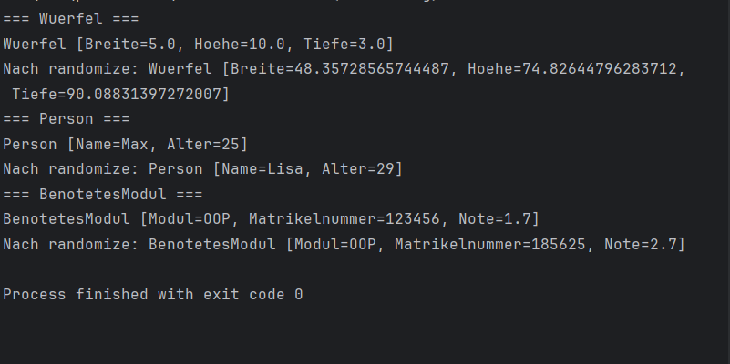

## Beschreibung
In dieser Aufgabe habe ich eine Schnittstelle `CanRandomize` und drei Klassen implementiert.

Schnittstelle
`CanRandomize` schreibt die Methode `randomize()` vor. Jede Klasse die `implements CanRandomize` sagt, muss diese Methode implementieren.

## Klassen
- `Wuerfel` – definiert durch Breite, Höhe und Tiefe
- `Person` – definiert durch Name und Alter
- `BenotetesModul` – definiert durch Modulname, Matrikelnummer und Note

Jede Klasse besitzt:
- Einen Standardkonstruktor und einen Konstruktor mit Parametern
- Getter und Setter für alle Attribute
- Eine `toString()`-Methode
- Eine `randomize()`-Methode mit plausiblen Zufallswerten

## Zufallswerte
- `Wuerfel`: Breite, Höhe und Tiefe zwischen 1 und 100
- `Person`: echter Name aus einer Liste, Alter zwischen 1 und 99
- `BenotetesModul`: gültige Noten (1.0, 1.3 ... 5.0), 6-stellige Matrikelnummer

## Wie habe ich das Ergebnis erhalten ?

1. Interface `CanRandomize` mit Methode `randomize()` erstellt
2. Drei Klassen mit `implements CanRandomize` erstellt
3. In jeder Klasse `randomize()` mit plausiblen Zufallswerten implementiert
4. Im `Main` jede Klasse erstellt, dann `randomize()` aufgerufen

### Manuell ausführen:
1. Datei `Main.java` in IntelliJ öffnen
2. Auf den grünen Pfeil ▶️ neben `public static void main(String[] args)` klicken
3. Das Ergebnis erscheint im Run-Fenster unten in IntelliJ

## Beispielausgabe

